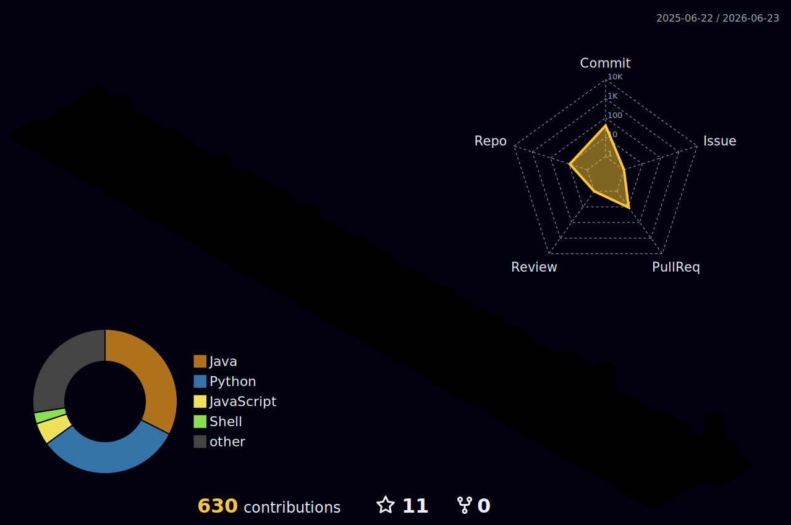

<div align="center">

# Hi 👋, I'm Zhenyuan

**Computer Science Student ｜ Software Developer ｜ Server Administrator**

<br>

<a href="https://git.io/typing-svg"></a>

<br>

🌍 Owner & Admin of [OriginCraft](https://origincraft.tw/), a thriving Minecraft server community.<br>
🔭 Exploring boundaries in **Full-Stack Development**, **Machine Learning**, and **AR/Mobile Apps**.

<br>

[](https://discord.com/users/513592506458308608)

### 🌐 Socials & Connect
[](https://discord.gg/ZwJ876pNvm)
[](https://www.youtube.com/@zhenyuan0427) 

</div>

<br>

## 💻 Tech Stack

### 💻 Languages
        

### 🌐 Frontend Development
     

### ⚙️ Backend & Server
     

### 📱 Mobile & AR
 

### ⛏️ Minecraft Ecosystem
 

### 🗄️ Databases
     

### 🧠 Machine Learning


### 📝 IDEs & Editors
  

### 🤖 AI & Design
  -FF6A00?style=for-the-badge&logo=figma&logoColor=white)

### 🛠️ Tools & DevOps
          

<br>

## 📈 Development Activity & Stats

### ⏱️ Coding Time
<!--START_SECTION:waka-->

```txt
From: 20 July 2023 - To: 30 April 2026

Total Time: 599 hrs 42 mins

Java              143 hrs 31 mins       ██████░░░░░░░░░░░░░░░░░░░   23.50 %
TypeScript        104 hrs 46 mins       ████▒░░░░░░░░░░░░░░░░░░░░   17.15 %
Vue.js            71 hrs 26 mins        ███░░░░░░░░░░░░░░░░░░░░░░   11.70 %
Python            48 hrs 44 mins        ██░░░░░░░░░░░░░░░░░░░░░░░   07.98 %
JavaScript        35 hrs 58 mins        █▒░░░░░░░░░░░░░░░░░░░░░░░   05.89 %
Other             11 hrs 7 mins         ▒░░░░░░░░░░░░░░░░░░░░░░░░   01.82 %
```

<!--END_SECTION:waka-->
<br>

<div align="center">

[](https://git.io/streak-stats)



</div>
