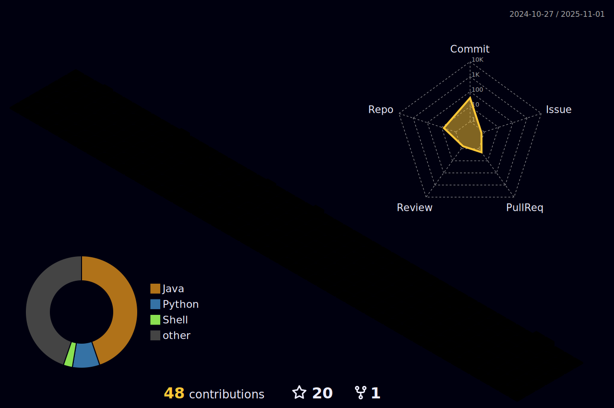

# 💫 About Me:
Hi 👋, I'm Zhenyuan 🌍 I'm the owner of OriginCraft. A fun minecraft server. 🛰️ I'm the founder of Gatheria APP. A new generation of GPS social APP.  

## ⏱️Coding Time:</h3>
  

## 🌐 Socials:
  

# 💻 Tech Stack:
                                      

# 📊 GitHub Stats:
 
 
 

### ✍️ Random Dev Quote

---

